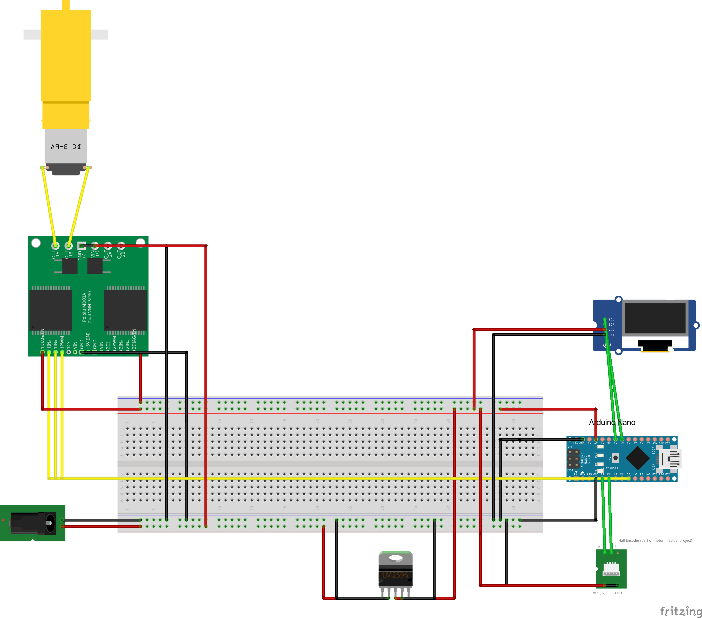

## What is a PID Controller?

I’m trying to go deeper into embedded work, so this wasn’t about just making a motor spin. I wanted to see what all the control theory actually looks like when it meets real hardware. Things don’t behave as cleanly as they do in simulation, and that was the whole point. Writing the PID loop myself in C++ let me experiment, break things, and slowly understand what was actually going on.

### My Understanding of PID 
PID stands for **Proportional, Integral, Derivative**. It’s a closed-loop control method that continuously reduces the error between a target value (setpoint) and the measured value (process variable).

The way it clicked for me was thinking about cruise control in a car.  
If the setpoint is 70 mph and the current speed is 62 mph, the error is 8 mph.  
A PID controller looks at that error and decides how hard to drive the motor.

At a high level:

* **P** increases output in proportion to the size of the error  
* **I** removes long-term offset by accumulating past error  
* **D** slows the system when the error is changing too quickly  

Each term has trade-offs.  
P alone can leave a steady-state error.  
I can eliminate that but risks integral windup if the actuator saturates.  
D helps reduce overshoot and jitter by reacting to how fast the error is changing.

## Hardware Design

### Hardware List

**Motor / Encoder**  
*12V DC motor with built-in quadrature encoder*  
25GA370 DC Encoder Metal Gearmotor – 12V, 150 RPM, Two-Channel Hall-Effect Encoder

**Microcontroller**  
Arduino Nano [A000005] – ATmega328P, 22 Digital I/O Pins, 8 Analog Inputs, USB Interface

**Breadboard + Jumpers**  
BOJACK Solderless Breadboard Kit – 830pt + 400pt boards and jumper wires

**Power Supply (AC → DC)**  
12V 2A regulated wall adapter

**Buck Converter**  
Maxmoral LM2596 Step-Down (DC-DC) Module – for generating 5V logic power

**Motor Driver**  
DROK L298 Dual H-Bridge Motor Speed Controller – optocoupler isolation, 6.5V–27V input

**Display**  
ELEGOO 0.96" OLED I2C Display (SSD1306-compatible)

### Wiring Diagram

I wanted to keep the wiring for this project as simple as possible, so here’s the whole layout in one place. The idea is straightforward: 12V comes in through the barrel jack, the buck converter steps that down to 5V for all the logic, and the motor driver handles the power for the motor. Everything else (encoder, OLED, Arduino) taps into the shared 5V/GND rails and feeds its signals back into the Arduino for control. I used Fritzing to build the wiring diagram below: 

**Quick reference:**
- **12V** → motor driver VIN + buck converter IN  
- **Buck converter 5V** → Arduino + OLED + encoder + motor driver logic  
- **Encoder A/B** → D2 / D3 on Arduino
- **OLED SDA/SCL** → A4 / A5 on Arduino
- **Motor driver DIR/PWM** → D4 / D6 on Arduino
- **All grounds** tied into one common rail

## Software Design

### Tooling and Development Environment

There are two parts to this project, the code I designed and the tools I used to write it. For the tooling, I did some research on writing firmware for an Arduino microcontroller. Since I am using an Arduino board I could have used the Arduino IDE, but I chose PlatformIO with VS Code instead. I already use VS Code for everything else, so being able to write embedded software in the same environment felt natural.

Installing PlatformIO was straightforward, and it handles building and uploading to the microcontroller with just a few clicks. It has been great so far, and it is probably what I will continue to use.

---

### Design Approach, or How I Stumbled My Way Into a PI Controller

The difficulty here is that I have no industry experience to guide best practices, so I am navigating this space mostly on my own. To make matters more interesting, I had never written firmware before this project, so I also did not fully understand how the board actually worked.

To fill in some of the gaps I started reading *Making Embedded Systems* by Elecia White. It has been extremely helpful. Two quotes that stuck with me from the software design chapter were:

> “Implement features, make them work, test them out, and then make them smaller or faster as needed,” — Elecia White
 
> “Premature optimization is the root of all evil,” — Donald Knuth

I know that does not mean ignore design entirely and jump right in, but since I had zero embedded experience I decided to lean into tinkering first, just to understand the system. My goal was to get something working, then refine it.

So I started small:

* First I blinked an LED.
* Then I drove the motor in one direction.
* Then I initialized the OLED and displayed a simple message, without worrying about RPM yet.

Each step taught me something, and the structure of the program started to become clearer. At that point I realized I was not that far from a working control loop. All I really needed was the math.

---

### Version 1, Big File, Global Variables, It Works

Version one of the program was essentially everything in a single file. I already had an ISR, pin modes, and global variables defined, so the remaining task was implementing the control math, which was the hardest part conceptually.

I started with proportional control only. I figured to start all I needed was for the motor to respond to a setpoint and increase RPM. I sketched the control flow on paper, translated the proportional equation into code, and got a working response faster than I expected.

For the constants Kp and Ki I literally started with values from the PID Wikipedia article. Kp at 0.5 worked surprisingly well and I left it alone. A Ki of 0.5 was far too high, so through a very scientific process of tinkering I kept lowering it until it worked.

With only proportional control I immediately saw steady state error, so I added the integral term. That required handling integral windup. I implemented a simple gating approach that prevents the integral from accumulating when the motor is at its PWM limits and the error would push it further in the same direction. The PWM output is always clamped to the valid range of 0 to 255.

I did not find overshoot to be severe with just P and I, so I chose not to implement D for now. That may be a future experiment, possibly along with delving into RTOS, which I know nothing about.

---

### Version 2, Refactor Time

The controller worked and the code was functional but messy, with a lot of global state. However, the design became a lot more obvious. I had clear groups of functionality for the motor, the display, and the PI controller.

So, for version two, I refactored the code by creating `Display` and `PID` classes to encapsulate their behavior.

For the display I wanted the user to be able to pass values of different types, within the limits of the Adafruit library, so I built a templated display function that can print different data types without duplicating code.

For the motor I did not create a class and instead used a `struct` to group its core state, such as RPM, setpoint, and PWM. This keeps it lightweight and reflects the fact that the motor module does not own control logic, it simply holds values used by other components.

All shared types are grouped into a `Types.h` file for organization.

---

### Final Thoughts

I get it, this is not an industry level architecture, and an embedded engineer might tsk-tsk and shake their head at the above, but it reflects my current level of experience. As I continue reading and working on embedded systems I expect my design process to become more formal.

For now the focus was on having some old fashioned embedded fun, learning the hardware, implementing a working control loop, and then improving the structure afterward.

**Tinkering for the win!**

